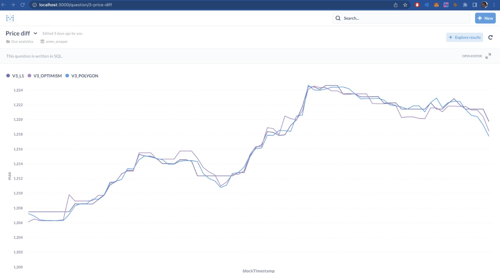

# DeFi Scraper

A command-line application that scrapes prices for different Uniswap v3 pools.

I strated off this project to find arbitrage opportunities. *Silly, I know that now.*

Anyway, it ended becoming a Scraper instead. Not useful for making money. But useful to start making a DApp, that can communicate with multiple different networks.

I ran with with the following:

- Ethereum L1
- Polygon
- Arbitrum

But the code is modular enough. Its easy to add other Ethereum based networks (including test nets).

## Installation

Its a standard nodeJs command-line application. You will need node (and npm) to run it.

For a fresh install, get the code and `cd` into the project dir (probably `defi-scraper`)

```
git clone git@github.com:vedant1811/defi-scraper.git
cd defi-scraper
npm install
```

## Usage


### DB Info

Update the postgres DB settings in [main.ts](./main.ts)- especially username and password.

You can create a new user and db with the config mentioned, or, update the file to match your config.

The table is created, if it is not present. You just need the user that has the required permissions. Ref: [notes.sql](./notes.sql)

### Network Info

Again, update the [main.ts](./main.ts) file. Commend/uncomment the networks you want to scrape. Update the JSON RPC URLs to the ones you have access to.
I recommend to create a free account on Infura or Alchemy.

Then, run it with

```
npm start
```

The application will start scraping from the latest block in the network(s), and go backwards

## Features

### Idempotency

Before making a network call, it checks if the price for the blockNumber has been fetched or not. If the entry exists, the scraping is stopped.
This helps to re-run the script after it was interrupted.

### Makes DB entries

You can see view the results on a graph using a tool like [Free Metabase](https://www.metabase.com/start/oss/). Example:



### Concurrency

You can run multiple processes (via `npm start` on different terminals), to scrape from different networks, pools, and/or blockNumbers.


## To Do

- Take network and pool info from command-line args, instead of changing the code

- Start scraping from an arbitrary blockNumber. *Currently, you can do this by entering the blockNumber in uniswap.ts file (in the end)*

- Allow pairs that have no stablecoin component
